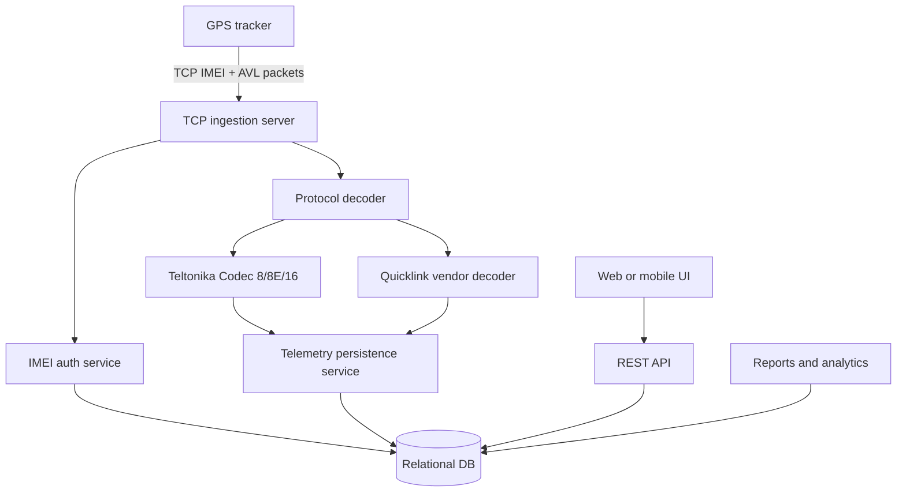
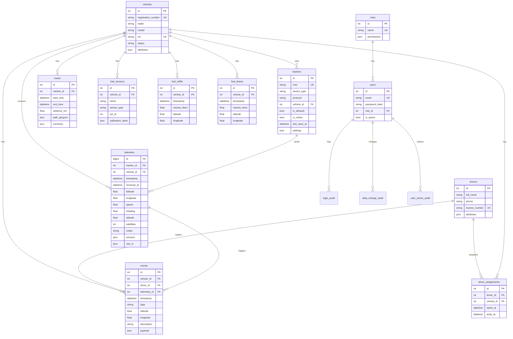

# SmartFleet architecture

## Runtime components

Responsibilities:

- **TCP ingestion server**: accepts many socket connections asynchronously, logs lifecycle/errors, performs Teltonika IMEI handshake and sends AVL acknowledgements.
- **Authentication service**: checks `trackers.imei`, optionally auto-registers new devices, rejects disabled trackers.
- **Protocol decoders**: validate packet integrity and normalize telemetry objects. Teltonika CRC-16/IBM is implemented; Quicklink requires vendor documentation.
- **Persistence service**: stores coordinates, timestamps, speed, GPS quality and all raw/named I/O parameters.
- **API**: exposes CRUD/query endpoints for frontend, mobile apps and integrations.

## ER diagram

## Important indexes

- `trackers.imei` — IMEI lookup during TCP handshake.
- `vehicles.registration_number` — fleet search by vehicle number.
- `telemetry(vehicle_id, timestamp)` — tracks and reports by vehicle and period.
- `telemetry(tracker_id, timestamp)` — latest packet and tracker-level diagnostics.
- `routes(vehicle_id, start_time, end_time)` — generated trip reports.
- `events(vehicle_id, timestamp)` — event timeline and reports.
- `fuel_refills(vehicle_id, timestamp)` and `fuel_drains(vehicle_id, timestamp)` — fuel analytics by period.

## Next implementation milestones

1. Add migrations with Alembic before production use.
2. Implement role-based access checks and JWT/session authentication in the API.
3. Add route, stop, fuel refill/drain and report generation services.
4. Add a frontend map using Leaflet/OpenLayers and OSM tiles.
5. Add a concrete Quicklink decoder after receiving the vendor protocol document.
6. Move high-load ingestion to PostgreSQL + queue workers when the tracker count grows.
